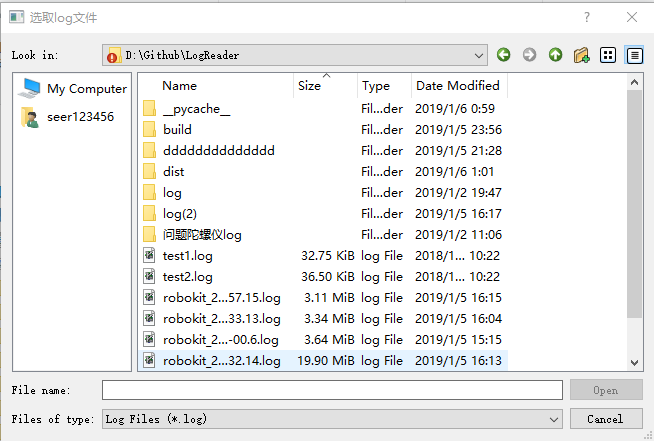

# LogReader
从log文件中读取IMU, Odometer, MCLoc, Send, Get, Laser, fatal, error, warning and notice信息

使用环境Python 3, 推荐使用[Anaconda](https://www.anaconda.com/download/)
* get_report.py 为生成错误报告的脚本。在命名窗口输入:<pre><code>python test_get_report.py test1.log test2.log</pre></code>
  将test1.log和test2.log替换为所需的log文件即可

  **将release中的get_report.exe置于rbk目录下，运行get_report.exe可以自动读取diagnosis\\log下的log文件，并生成报告**
* test.py 为调用 loglib.py的示例。在命名窗口输入:<pre><code>python test.py test1.log test2.log</pre></code>
 test1.log, test2.log 为测试读取的log
* test_gui.py 为图形化的log解析器
  * 使用方式：在命令窗口中处输入:<pre><code>python test_gui.py test1.log test2.log</pre></code>
  将test1.log和test2.log改为对应的log文件名即可
  * 支持两条曲线比较
  * 支持时间窗口选取
  * 支持定位(mcl), 里程(odo), 惯性传感器(imu), 下发速度(send), 获取速度(get)
  * 支持fatal, error, warning, notice的同步显示, 并且输出到Report.txt中
  * Evaluate可以输入的参数:
    * 定位: mcl.x, mcl.y, mcl.theta, mcl.confidence
    * 惯性传感器: imu.yaw, imu.ax, imu.ay, imu.gz, imu.gx, imu.gy, imu.gz, imu.offx, imu.offy, imu.offz
    * 里程: odo.x, odo.y, odo.theta, odo.stop,  odo.vx, odo.vy, odo.vw, odo.steer_angle
    * 下发速度: send.vx, send.vy, send.vw, send.steer_angle, send.max_vx, send.max_vw
    * 获取速度：get.vx, get.vy, get.vw, get.steer_angle, get.max_vx, get.max_vw
* 图形界面截图

* loggui.py 为PyQt5图形化的log解析器
  * 使用方式：直接运行即可
  * 支持两条曲线比较
  * 支持时间窗口选取
  * 支持定位(mcl), 里程(odo), 惯性传感器(imu), 下发速度(send), 获取速度(get)
  * 支持fatal, error, warning, notice的同步显示, 并且输出到Report.txt中
  * Evaluate可以输入的参数:
    * 定位: mcl.x, mcl.y, mcl.theta, mcl.confidence
    * 惯性传感器: imu.yaw, imu.ax, imu.ay, imu.gz, imu.gx, imu.gy, imu.gz, imu.offx, imu.offy, imu.offz
    * 里程: odo.x, odo.y, odo.theta, odo.stop,  odo.vx, odo.vy, odo.vw, odo.steer_angle
    * 下发速度: send.vx, send.vy, send.vw, send.steer_angle, send.max_vx, send.max_vw
    * 获取速度：get.vx, get.vy, get.vw, get.steer_angle, get.max_vx, get.max_vw
* 图形界面截图

